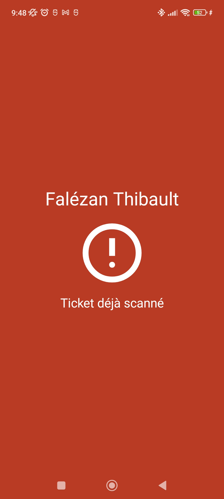

# Tickets Manager (POC)
Tickets Manager est un système de gestion de tickets, il permet de générer des tickets qui ont un QrCode via un site internet. Ce QrCode peut être scanné via une application android. 

| Photos site internet
| :--:  | :--: |
||

| Photos de l'application
| :--:  | :--: | :--: | :--: |
||||


## Tester le POC
Une application d'exemple a été déployé :
 - Site web : [http://37.59.100.229](http://37.59.100.229)
 - Application Android : [https://drive.google.com/file/d/1S9odpX5iFpBdnQA5BwPFQrgvfJRDKIpk/view?usp=drive_link](https://drive.google.com/file/d/1S9odpX5iFpBdnQA5BwPFQrgvfJRDKIpk/view?usp=drive_link)

## Structure de l'application


## Déployer le POC
Un fichier **compose** est mis à disposition pour déployer le service, il est important de ne pas oublier de changer les **identifiants et mot de passe** du **docker-compose**, il faut aussi mettre son adresse **ip publique** dans le **tickets_manager_api** du fichier **compose_deploy.yml** sinon il sera impossible de faire des requêtes vers l'API SpringBoot. 
Pour déployer le projet, exécuter la commande suivante :
```
 sudo docker-compose -f compose_deploy.yml build --no-cache
 sudo docker-compose -f compose_deploy.yml up -d
```
Une fois cela fait vous devez aussi modifier l'url de l'API dans l'application android. Pour ce faire modifier la variable apolloClient 
```
var apolloClient: ApolloClient = ApolloClient.Builder()
    .serverUrl("http://IP_DU_SERVEUR_ICI:PORT_ICI/graphql")
    .build();
```
Pour compiler et exporter l'application sur votre téléphone via AndroidStudio, vous pouvez vous référer à [cet article](https://developer.android.com/studio/run/device?hl=fr).


## Développer le POC
Pour développer POC, vous avez uniquement à lancer une BDD comme MariaDB, vous pouvez exécuter la commande suivante : 
```
 sudo docker-compose -f compose_mariadb_only up -d
```
Une fois cela fait, vous devez lancer l'API SpringBoot si vous travaillez sur le Site Web ou l'application android.


## IMPORTANT
Ce projet n'a pas été conçu pour être utilisé en condition réel, il n'y a pas de protection sur l'API n'importe qui peut faire des requêtes dessus (seul la suppression des données est impossible)